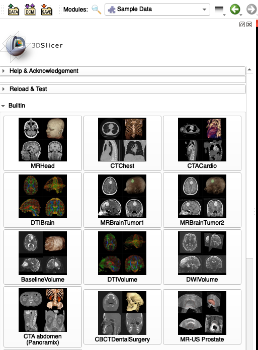
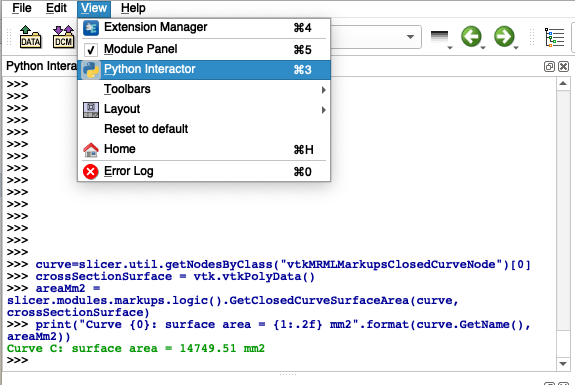
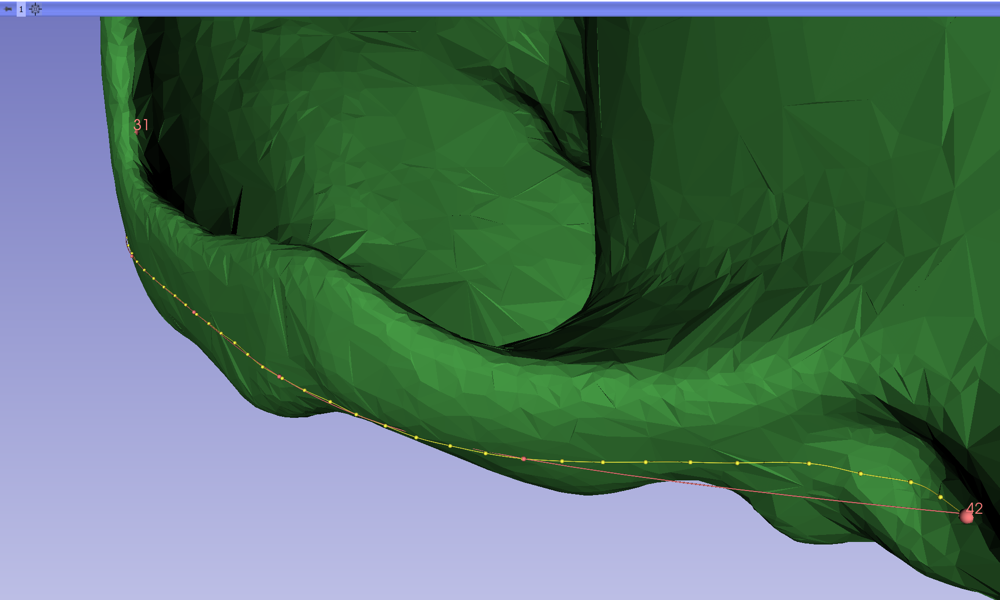

# Measurements and Visualization 
This tutorial was modified from lab 4 of the SlicerMorph workshop. For more infomration on measurments and visualizations in SlicerMorph see the full workhop: https://github.com/SlicerMorph/W_2020

## Markup Types
IMPORTANT: Before you start any markups make sure your volume spacing is correct in the `volumes` module! 

**ROI:**
Place two points sequentially that specify corners of a rectangular cube defining the region of interest. The size and shape of the rectangle can be adjusted after placement.

**Fiducials:**
Place a single landmark point.

**Lines:**
Sequentially place two points, creating a line between them.

**Angles:**
Place three points sequentially. This forms two vectors where the second point placed is the vertex. The angle beween the two vectors is displayed.

**Open and closed curves:**
Sequentially place points. A curve will be fit to the points and updated as additional points are added. If the closed curve is selected, the first and last points placed will be connected.


## Markup Placement
  * Slicer has two mouse modes: Transform, and Place. 
  * Transform mode is the default interaction mode. This mode allows interaction with loaded data (pan, zoom, rotate)
  * The icons in the mouse mode toolbar at the top of the main GUI allow to switch between these modes
  * Place mode allows to place one object then switches modes back to Transform mode. Fiducial is the default object.
  * If there is no active Markup node, one will be created with the first placement. Curve points and fiducials will be added to the active Markup node, if one exists. 
  * Place mode can be made persistent by clicking the checkbox in the mouse mode toolbar.


## Markup Management
Fiducial points and anchor points of lines, curves, and angles can be accessed and manipulated using the `Markups` module. 


  * In the Create menu, a new node Markups node can be created for fiducials, lines, angles, and curves.
  * In the Display menu, you can set the visibility, opacity, glyph and text size of a markup node. 
  * Expand the Advanced tab for additional options.
  * In the Control Points menu, use the table to adjust visibility, labels, and position of individual fiducials or anchor points. This is also where you can modify if you want just the numbers or just labels for markup points. 


## Example 1: Using Markups for Measurement
In this example, we will place a closed curve on one slice of a CT scan, measure the area of the curve, and visualize the region. For more detail and discussion, see the Slicer discourse thread [here](https://discourse.slicer.org/t/how-can-i-calculate-an-area-on-a-ct-image-i-can-calculate-volumes-mm-3-but-not-areas-mm-2/1549/7).

1. If you would like to follow along I'm working off of the MRIHead volume in the `Sample Data` module. 
 

2. Select the closed curve markup mode and place a curve around the brain tissue in the red view window (axial slice). You can change the Slicer layout to red window only for better detail. When placing the curve click as many times as you need to in order to get your desigred shape. One really handy tool in the `Markups` modlue is the resample cuve tool which will allow you to resample your curve with a given number of equally spaced points. 


3. If you're comfortable with python, you can script write in slicer using the Python Interactor. As an eample, open the Python Interactor and paste the following snippet of code to calculate the area of the curve we just outlined: 
```
curve=slicer.util.getNodesByClass("vtkMRMLMarkupsClosedCurveNode")[0]
crossSectionSurface = vtk.vtkPolyData()
areaMm2 = slicer.modules.markups.logic().GetClosedCurveSurfaceArea(curve, crossSectionSurface)
print("Curve {0}: surface area = {1:.2f} mm2".format(curve.GetName(), areaMm2))
```



4. Now we can visualize the area of the curve, type the following code snippet in the Python Interactor, then witch back to the conventional view:
```
crossSectionSurfaceModel = slicer.modules.models.logic().AddModel(crossSectionSurface)
crossSectionSurfaceModel.SetName("{0} surface".format(curve.GetName()))
crossSectionSurfaceModel.CreateDefaultDisplayNodes()
crossSectionSurfaceModel.GetDisplayNode().BackfaceCullingOff()
crossSectionSurfaceModel.GetDisplayNode().SetColor(curve.GetDisplayNode().GetColor())
crossSectionSurfaceModel.GetDisplayNode().SetOpacity(0.5)
crossSectionSurfaceModel.SetDescription("Area[mm2] = {0:.2f}".format(areaMm2))
```
 
 
## Visualization: Displaying Mesh Data
Mesh data in Slicer is displayed using the `Models` Module. It can not be rendered using the `Volume Render` module. Fiducial points are automatically placed on the surface of the a loaded mesh and will be constrained to the surface when they are moved. The control points for other markups are also constrained to mesh surfaces when present. 

## Example 2: Displaying a Mesh and resampling a curve on the surface
1. For this example I'm working off the Gorilla Skull Reference Model under the SlicerMorph tab of the `Sample Data` module (you will need SLicerMorph installed to see this option in the menu).


2.Center the dataset in the 3D viewing window using the button at the top left of the window. Optionally, change to the 3D only layout.


3. Open the `Models` module. Experiment with changing the color and opacity of the skull.


4. Select open curve placement mode from the upper menu bar and place a curve between landmarks **35** and **42** using approximately 10 points. Note that the control points are snapped to the mesh, but the curve itself may lie above or below the mesh surface. 


5. Open the `Markups` module. Expand the Resample Menu. Select **Create a new markups curve** from the Output node selector and set the number of resampled points to 50. In the **Constrain points to surface** menu, select the loaded gorilla mesh. Before resampling, confirm that the curve to be resampled is selected as the active node in the `Markups` table. 


Click the **Resample curve** button to generate a new open curve with 50 points constrained to the mesh surface. This results in a curve that is closer to the actual surface curvature than the original. Note any difference in length between the original and resampled curves reported in the `Markups` table.


## Visualization: Volume Rendering
The `Volume Rendering` module provides interactive visualization of 3D image data. For full documentation of the panel and functions, see [here](https://www.slicer.org/wiki/Documentation/Nightly/Modules/VolumeRendering#Panels_and_their_use).
  * Only scalar volumes can be used for volume rendering. Vector volumes (eg jpg, png, bmp, or other classic 2D formats) can be converted to scalar volumes using the [VectorToScalarVolume module](https://www.slicer.org/wiki/Documentation/Nightly/Modules/VectorToScalarVolume).
  * 3D Slicer uses volume ray casting to computes 2D images from 3D volumetric data sets. Unlike surface reconstruction, there is no estimation of object surfaces or segmentation.
  * The values displayed are calculated using a transfer function that incorporates voxel intensities, material properties, and illumination.
  * The opacity and color of the image can be adjusted by modifying their transfer functions in the `Volume Rendering` module.

 
 
  * Slicer supports both CPU and GPU volume rendering. CPU based will always work, whether you are on a computer without a dedicated graphics card, or on a remote connection (which may not support hardware accelerated graphics), but it is slow. GPU requires you have a dedicated graphics card with 1GB or more videoRAM, but it is much faster. 
  * If you have a dedicated graphics card, you may want to set the default visualization method to GPU rendering using the menu option in: Edit->Preferences 
  * Always set the rendering quality to normal 
  * The physical limits to the size of the volumes that can be rendered are determined by the graphics card RAM and MAX_3D_TEXTURE_SIZE. Every dimension of the image must be less than the value of the MAX_3D_TEXTURE_SIZE and the full dataset must fit into GPU’s RAM. For the full discussion on these limits, see the Slicer discourse thread [here](https://discourse.slicer.org/t/what-spec-gpu-is-required-for-gpu-volumentric-rendering/1596).
  * Driver issues: To configure laptops with two GPUS see [this discussion](https://discourse.slicer.org/t/can-i-choose-which-gpu-to-use/3149)
  * Crop 3D view vs Crop Volume confusion


## Example 3: Volume Rendering 
1. Load the MRIHead volume from the `Sample Data` module.
2. Open the `Volume Rendering` module. In the **Volume** field, make sure the volume MRHead is selected. Click the eyeball next to the **Volume** field to display the image. You can change the 3D Slicer layout to 3D only.


3. Expand the **Advanced** tab to view the opacity and color transfer functions. You can click on these functions to move or add additional control points.


4. Under the **Display** tab, click on the **Select a Preset** menu. This menu contains saved transfer functions that work well for common data types. Select **MRI Default** (row 4, column 5). Try adjusting the color and opacity functions of this suggested display setting.

